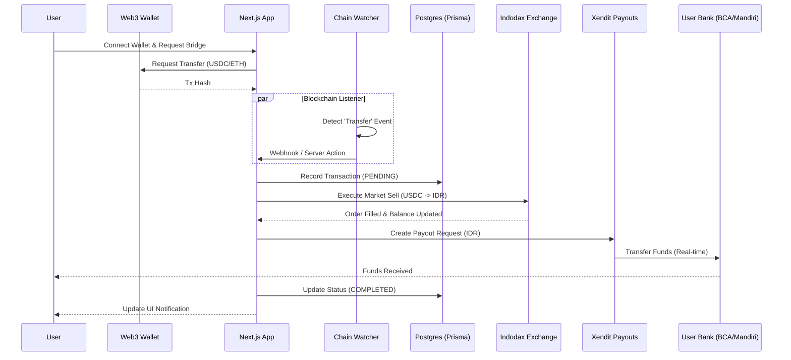

# 🇮🇩 Nusantara Bridge

**Nusantara Bridge** is Indonesia's premier crypto-to-fiat bridge, designed to facilitate instant settlements from EVM-compatible blockchains (Ethereum, BSC, Polygon) directly to Indonesian bank accounts (IDR).

Built with performance, security, and permissionless access in mind, this application acts as an orchestration layer between decentralized wallets, centralized exchanges (Indodax), and payment gateways (Xendit).


---

## 🏗 Architecture

The system follows an event-driven architecture to bridge on-chain assets to off-chain fiat currency.



## ✨ Key Features

- **Permissionless Access**: No KYC required for the user interface. Connect via Viem/Wagmi and bridge immediately.
- **Multi-Chain Support**: Seamlessly switch between Ethereum Mainnet, BSC, and Polygon.
- **AI Market Insights**: Integrated **Google Gemini AI** to provide real-time trading advice and volatility warnings before you bridge.
- **Real-time Settlement**: Uses Xendit's enterprise disbursement API for sub-minute fiat transfers.
- **Liquidity Aggregation**: Fetches best-bid rates from Indodax to ensure minimal slippage.
- **Responsive Dashboard**: Beautiful, dark-mode UI built with Tailwind CSS and Recharts.

## 🛠 Tech Stack

- **Frontend**: Next.js 14 (App Router), React 19, Tailwind CSS.
- **Blockchain Interaction**: `viem` (Type-safe Ethereum interface).
- **Backend Logic**: Next.js Server Actions.
- **Database**: PostgreSQL with Prisma ORM.
- **External APIs**: 
  - **Indodax** (Crypto Exchange).
  - **Xendit** (Fiat Disbursement).
  - **Google GenAI** (Gemini 2.5 Flash).
- **Monitoring**: Custom Chain Watcher script.

## 🚀 Getting Started

### Prerequisites

- Node.js v18+
- PostgreSQL Database
- An Ethereum Wallet (Metamask, Rabby, etc.)

### Installation

1. **Clone the repository**
   ```bash
   git clone https://github.com/yourusername/nusantara-bridge.git
   cd nusantara-bridge
   ```

2. **Install dependencies**
   ```bash
   npm install
   ```

3. **Configure Environment**
   Copy the example environment file and fill in your credentials.
   ```bash
   cp .env.example .env
   ```

4. **Initialize Database**
   ```bash
   npx prisma generate
   npx prisma db push
   ```

5. **Run Development Server**
   ```bash
   npm run dev
   ```

### Running the Chain Watcher

The bridge requires a watcher to detect on-chain deposits. Run this in a separate terminal:

```bash
# Ensure you have ts-node or run via build
npx ts-node scripts/watcher.ts
```

## 📂 Project Structure

```
├── app/                # Next.js App Router pages and layouts
│   ├── actions/        # Server Actions (Bridge logic)
│   ├── api/            # Internal API routes (Webhooks)
│   └── ...
├── components/         # Reusable UI components (Charts, Swap Interface)
├── lib/                # Library wrappers (Indodax, Xendit, Prisma)
├── prisma/             # Database schema
├── services/           # Business logic services (Mock backend, AI)
├── scripts/            # Standalone scripts (Blockchain Watcher)
└── types.ts            # TypeScript definitions
```

## 🛡 Disclaimer

This project is a **Proof of Concept (PoC)**. 
- The `services/mockBackend.ts` mimics production delays and success rates.
- Real money transactions require valid API keys from Indodax and Xendit in `.env`.
- Ensure smart contracts are audited before mainnet deployment.

## 📄 License

MIT License.
